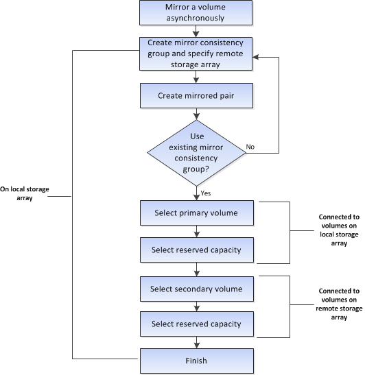

= Workflow de mise en miroir asynchrone d'un volume
:allow-uri-read: 
:icons: font
:imagesdir: ../media/

[role="lead"]
Dans System Manager, il est possible de mettre en miroir un volume de manière asynchrone en suivant ces étapes.

== Workflow permettant d'effectuer une paire en miroir pour les volumes primaires sur un système existant non géré avec System Manager

Si vous avez créé un volume primaire sur un système existant non géré avec System Manager, vous pouvez créer le volume secondaire avec SANtricity System Manager.

image::../media/workflow-for-mirroring-volume-asynchronously.png[workflow pour la mise en miroir de volume de manière asynchrone]
